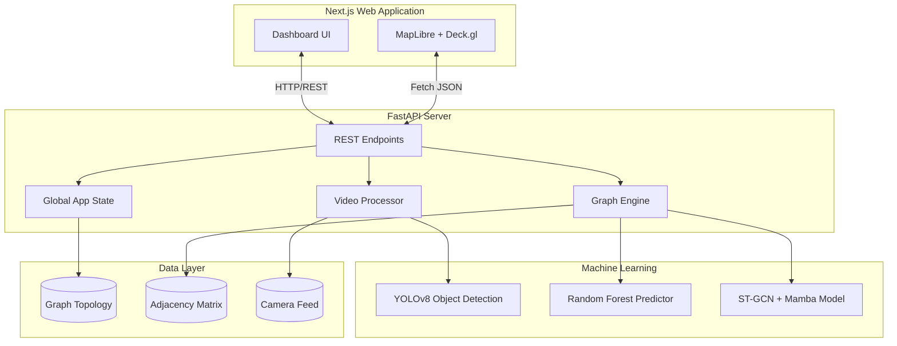
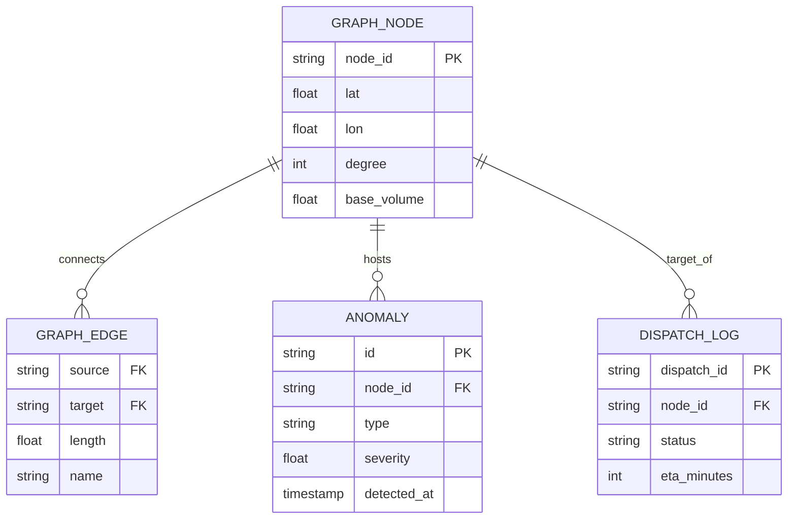
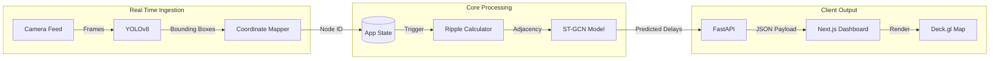
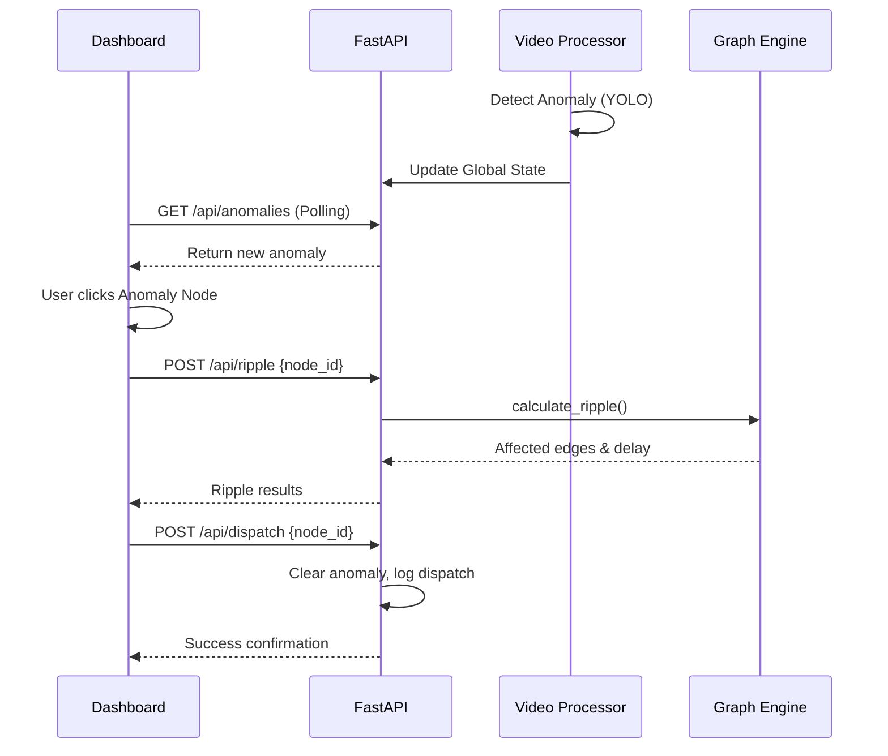
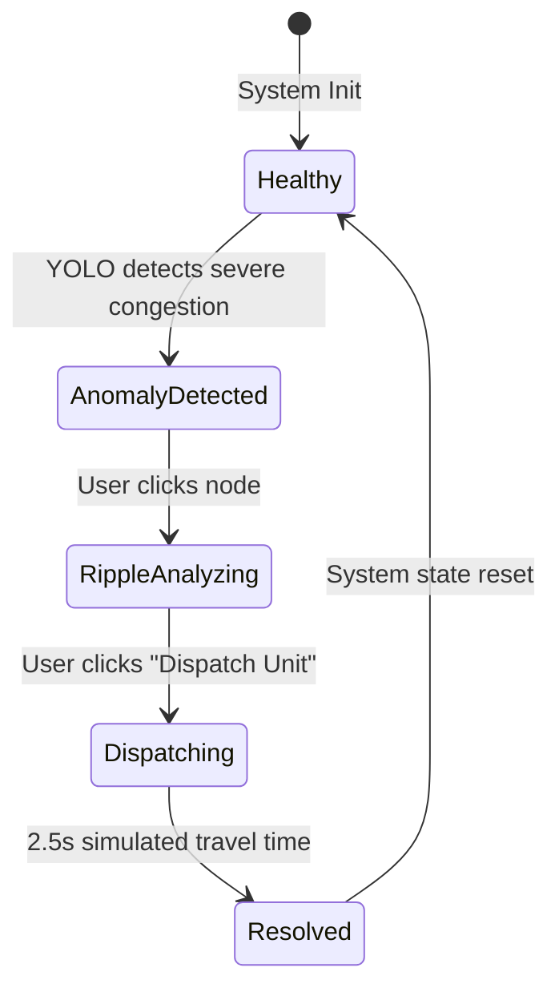

# Argus AI: System Architecture & Design Document

## 1. Solution Architecture

Argus AI is an intelligent urban spatial analysis platform that combines real-time video anomaly detection with predictive traffic modeling using a custom ST-GCN + Mamba architecture.

## 2. Low-Level Design (LLD)

The backend is modularized into distinct components:

- **`main.py`**: The FastAPI entry point. Handles all routing (`/simulate`, `/api/ripple`, `/api/dispatch`), initializes models into memory on startup, and orchestrates the global state.
- **`state.py`**: Holds the `app_state` dictionary, acting as an in-memory data store for anomalies, active ripples, and dispatch logs.
- **`graph_engine.py`**: Responsible for calculating "ripple effects" (traffic delays cascading across nodes) using either the ST-GCN model or a Dijkstra-based fallback.
- **`video_processor.py`**: Ingests video frames, runs YOLOv8 inference to detect vehicles/objects, and maps their pixel coordinates back to spatial graph nodes.
- **`layers.py` / `train_stgcn.py`**: Defines the custom neural network layers (`GraphAttentionLayer`, `SelectiveStateSpaceLayer`, `AsymmetricFocalRegressionLoss`) required to deserialize and run the Nexus Flow v2 model.

## 3. Data Sources & Data Engineering

### Data Pipeline Approach
1. **Network Extraction**: The physical road network of Koramangala, Bangalore was extracted using OSMnx. Intersections became nodes; road segments became edges.
2. **Historical Data Integration**: A synthetic dataset of police traffic violations (Jan-May) was mapped onto these nodes to provide congestion weighting.
3. **Graph Construction**: The `train_stgcn.py` script processed this data to generate an Adjacency Matrix (`adjacency_matrix.npy`) and a serialized JSON representation of the graph (`graph.json`).
4. **Real-time Ingestion**: Video feeds are processed locally, and bounding box coordinates are mapped linearly to the geographic bounding box of the graph network.

## 4. Data Model (ER Diagram)

## 5. Data Flow Diagram (DFD)

## 6. Sequence Diagram: Anomaly Resolution

## 7. State Transition Diagram: Anomaly Lifecycle

## 8. List of Data Sources

1. **OSMnx Road Network**: Topology of Koramangala, Bangalore (approx. 2290 nodes, 5710 edges).
2. **Traffic Violation Dataset**: Synthetic CSV modeling historical congestion patterns.
3. **Video Feed**: `loop.mp4` serving as a proxy for real-time CCTV streams.
4. **Nexus Flow Model Weights**: Pre-trained ST-GCN weights (`nexus_flow_model_weights.weights.h5`).

## 9. Open-Source Tools & Libraries Planned for Use

**Frontend:**
- **Next.js 14**: React framework for UI.
- **Tailwind CSS**: Utility-first styling.
- **Deck.gl / MapLibre GL JS**: High-performance WebGL-based spatial visualization.

**Backend:**
- **FastAPI / Uvicorn**: High-performance asynchronous API server.
- **OpenCV (cv2)**: Video frame processing.
- **Ultralytics YOLO**: Real-time object detection.

**Machine Learning & Data:**
- **TensorFlow / Keras**: Deep learning framework for the ST-GCN model.
- **Scikit-Learn / Joblib**: Random Forest pipeline handling.
- **NumPy**: Matrix and tensor operations.
- **OSMnx / NetworkX**: Graph topological extraction and routing.

## 10. Model Architecture Details

The core predictive engine is the **Nexus Flow v2** model. It combines Spatial and Temporal modeling:

1. **Spatial Representation**: Uses a custom `GraphAttentionLayer` (GAT) to pass messages along the physical road network adjacency matrix.
2. **Temporal Modeling**: Replaces traditional LSTMs with a `SelectiveStateSpaceLayer` (Mamba block) for highly efficient, long-context temporal sequence modeling.
3. **Loss Function**: Trained using `AsymmetricFocalRegressionLoss` to heavily penalize under-predicting severe traffic spikes, ensuring the system is highly sensitive to critical anomalies.
